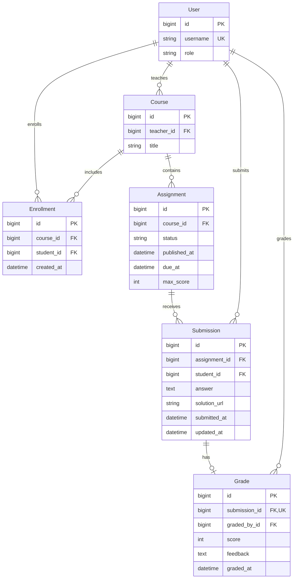

# Архитектура StudyFlow

StudyFlow — монолитное REST API. Приложение `users` отвечает за пользователей
и аутентификацию, `courses` — за курсы, зачисления и прогресс, `assignments` —
за задания, решения и оценки. Общие настройки, маршруты, фильтры и пагинация
находятся в `config`. Данные хранятся в PostgreSQL.

Инструкции запуска находятся в [README](../README.md), описание проекта для
резюме — в [resume.md](resume.md).

## Модель данных

`User` расширяет `AbstractUser`. Один преподаватель владеет несколькими курсами;
студенты связаны с курсами через отдельную модель `Enrollment`. Решение принадлежит
одновременно студенту и заданию. Оценка — отдельная необязательная запись
с отношением один к одному к решению.

## Доступ к данным

JWT определяет пользователя. Его актуальная роль и активность читаются из БД
при аутентификации; роль не копируется в собственные claims токена. Поэтому
смена роли влияет и на запросы с ранее выданным access-токеном.

Queryset сначала ограничивается владельцем курса или зачислением. Студенту
дополнительно доступны только опубликованные задания и собственные решения.
Поиск, фильтры и пагинация применяются к уже ограниченному набору. Чужой объект
возвращает HTTP 404, а запрещённое действие над доступным объектом — HTTP 403.
Вложенные URL проверяют связь задания с курсом и решения с заданием.

Разрешения проверяют роль и владение при изменениях. Сервер берёт автора,
владельца и связи объектов из пользователя и URL. Сериализаторы отклоняют
переданные клиентом служебные и неизвестные поля. Публичные вложенные профили
содержат идентификатор, username, имя и фамилию, без email и пароля.

Роль `teacher` не даёт доступа к Django Admin. Административные флаги также
не расширяют права в API. Регистрация создаёт студента; роль преподавателя
назначает суперпользователь через админку. Admin использует сессии Django.

## Состояния и целостность

Задание создаётся в состоянии `draft`. Действие `publish` переводит его
в `published` и записывает `published_at`. Повторная публикация сохраняет
первоначальную дату. Обратного перехода через API нет; удалить можно только
черновик. Условие, срок и максимальный балл можно менять после публикации.

У решения нет столбца состояния: `submitted` означает отсутствие `Grade`,
`graded` — наличие оценки. Это исключает расхождение статуса и записи оценки.
Повторная проверка обновляет ту же оценку. Проверенное решение студент менять
не может: комментарий и балл остаются привязаны к проверенному содержимому.

| Правило | Где обеспечивается |
| --- | --- |
| Одно зачисление на пару курс–студент | `UniqueConstraint` в `Enrollment` |
| Одна работа на пару задание–студент | `UniqueConstraint` в `Submission` |
| Одна оценка на решение | `OneToOneField` в `Grade` |
| Максимум задания от 1 до 1000; оценка от 0 до 1000 | Валидаторы и `CheckConstraint` |
| Черновик без даты публикации, опубликованное задание с датой | `CheckConstraint` |
| Текст и ссылка не могут одновременно быть пустыми строками | `CheckConstraint`; сериализатор также отклоняет текст из пробелов |
| Оценка не выше текущего максимума задания | Проверка в API внутри транзакции с блокировками |
| Отправка и исправление до дедлайна, изменение только непроверенной работы | Проверки в API внутри транзакции с блокировками |

Межтабличное правило `Grade.score <= Assignment.max_score` проверяется
приложением: обычное ограничение `CHECK` относится к одной строке.
При снижении максимума API проверяет уже выставленные оценки. В админке
решения и оценки доступны только для чтения, а максимум существующего задания
не редактируется. Прямые изменения через ORM или SQL требуют соблюдения этих правил.

Удаление пользователя защищено `PROTECT`, если он владеет курсом, отправил
решение или указан проверяющим. Удаление зачисления сохраняет работы и оценки;
студент теряет доступ к курсу, преподаватель продолжает видеть сданные работы.

## Параллельные запросы

Критичные операции API используют `transaction.atomic()` и `select_for_update()`.
Порядок работы с блокировками — **Assignment → Submission → Grade**:
сначала строка задания, затем существующее решение, затем создание или обновление
оценки. Операции, которым нужны только первые строки, на них и останавливаются.

| Одновременные действия | Результат синхронизации |
| --- | --- |
| Две отправки одной работы | После первой вставки второй запрос видит существующее решение и возвращает HTTP 409 |
| Отправка или исправление и изменение дедлайна через API | Проверка срока выполняется после получения блокировки задания |
| Исправление ответа и оценивание | Преподаватель оценивает сохранённый ответ; после появления оценки дальнейшее исправление запрещено |
| Оценивание и снижение максимального балла | Проверка использует актуальные данные; нельзя сохранить оценку выше максимума |

Блокировка задания упрощает общий порядок операций, но последовательно
обрабатывает записи даже разных студентов одного задания. Это осознанный
компромисс текущей реализации. Дедлайн проверяется перед сохранением после
получения блокировки, а не по времени начала HTTP-запроса.

PostgreSQL используется и в разработке, и в тестах: проверки конкурентных
запросов зависят от настоящих блокировок строк. Замена тестовой БД на SQLite
не проверяла бы это поведение. Сценарии гонок вынесены в отдельные тесты.

## Списки и прогресс

Связанные объекты загружаются через `select_related`: например, список решений
получает студентов, оценки и проверяющих без отдельного запроса на каждую строку.
Прогресс вычисляется SQL-агрегатами `Count` и `Sum`: отдельно общие показатели
опубликованных заданий, затем показатели текущих участников курса. Черновики
и другие курсы исключены. Нулевая оценка считается проверкой.

`completion_percent` — доля сданных заданий, а не доля набранных баллов.
`overdue_count` учитывает опубликованные задания с наступившим сроком без решения.
Студент видит свою строку, владелец курса — строки зачисленных участников.
Тесты числа SQL-запросов проверяют отсутствие N+1 при увеличении группы и списка работ.

Составные индексы покрывают поля `(course, status, due_at)` у заданий
и `(assignment, -submitted_at, -id)` у решений. Все списки используют
`PageNumberPagination`: 20 объектов по умолчанию, до 100 на страницу.
Идентификатор разрешает совпадения основного поля сортировки. Это обеспечивает
стабильный порядок при неизменных данных; вставки и изменения между запросами
могут смещать границы страниц.

## Проверки и ограничения

[GitHub Actions](../.github/workflows/ci.yml) запускает Ruff, проверки Django,
миграции, валидацию OpenAPI, pytest с покрытием и сборку Docker-образа.
Тесты охватывают права доступа, ограничения БД, переходы состояний, фильтрацию,
пагинацию и конкурентные запросы. Сборка образа сама по себе не проверяет запуск
контейнера. Правила запуска проверок и отчёты описаны в [руководстве разработчика](development.md#ci).

Compose предназначен для локальной разработки и запускает `runserver`.
Готовой конфигурации production-развёртывания в проекте нет. Также пока нет
клиентского интерфейса, истории попыток и оценок, возврата работы на доработку,
загрузки файлов и выполнения присланного кода. Ссылка на решение сохраняется
без обращения к её содержимому. Ротация и отзыв refresh-токенов не реализованы.

## Возможное добавление ИИ

ИИ пока не подключён. Отдельный сервис рекомендаций мог бы получать условие
задания и решение, сохранять черновик обратной связи и сведения о модели.
Такой результат не должен автоматически менять `Grade`: преподаватель
просматривает рекомендацию и принимает окончательное решение через существующее
оценивание. Этот подход отделяет необязательную обработку от сдачи работ
и оставляет авторство итоговой оценки у преподавателя.
